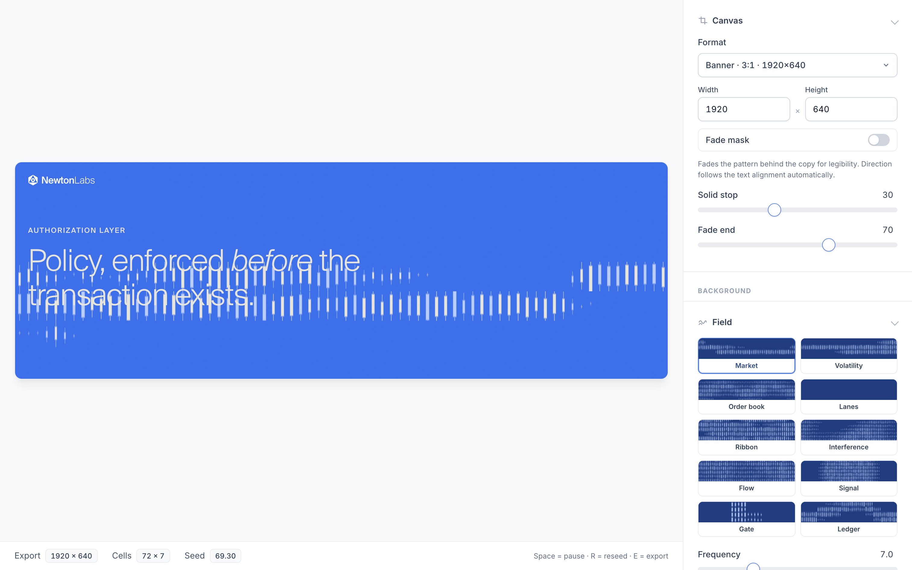
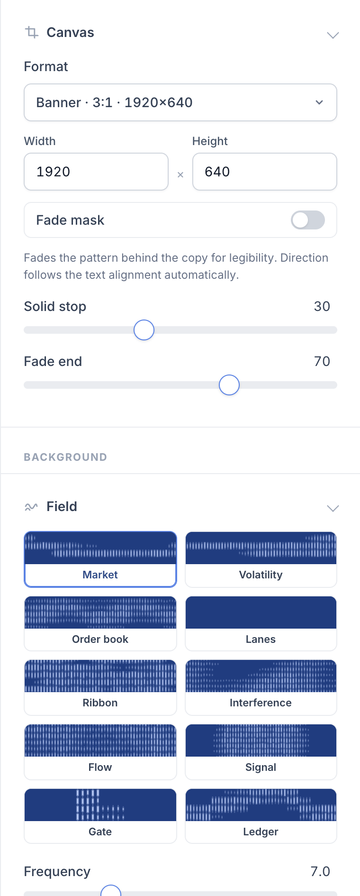
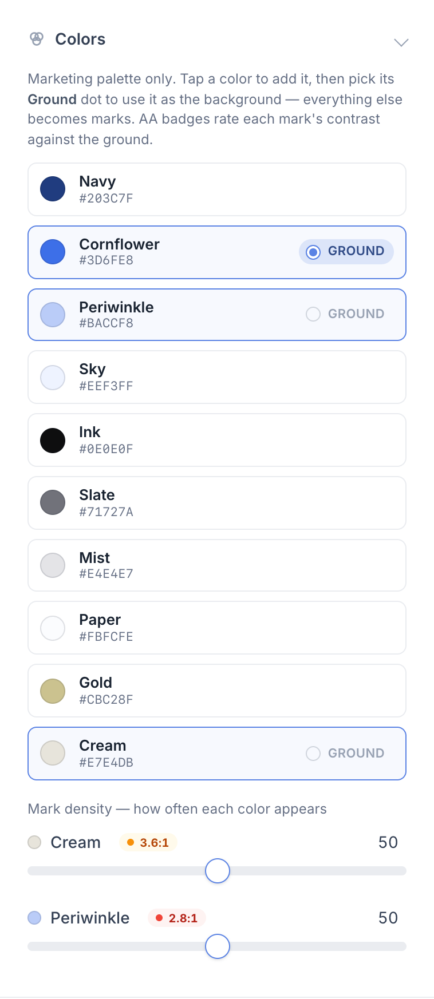
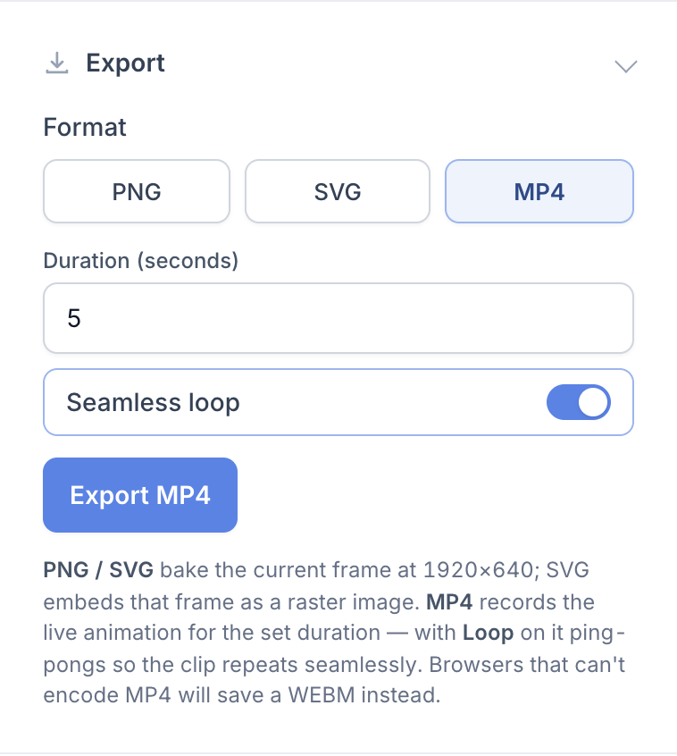

# Social Post — Newton Field Generator

An interactive tool for generating Newton-branded background patterns and motion,
ready to drop into social posts, banners, and other marketing surfaces.



## View it

**Live link:** https://alisonhu-magic.github.io/social-post/

It's a single self-contained HTML file (fonts, shaders, and logo are embedded), so it
also works offline — just open `index.html` in any modern browser.

## Quick start

1. Open the live link (or `index.html`).
2. Pick a **canvas format** at the top of the panel (Banner, Square, Story…).
3. Choose a **Field** pattern and adjust colors, text, and logo.
4. Hit **Export** to save a PNG, SVG, or MP4.

Hover the canvas to reveal a small toolbar with **pause** and **reseed**.

## The editor

The right-hand panel is organized into task-ordered, collapsible groups so you can
work top to bottom: **Canvas → Background → Content → Guides → Export**.

<table>
<tr>
<td width="33%" valign="top">

**Canvas & Field**

Start with a format preset (or type exact dimensions), then choose one of ten
procedural fields. Each field shows a live micro-render thumbnail so you can see the
outcome before selecting it.

</td>
<td width="33%" valign="top">

**Colors**

A fixed marketing palette — tap a color to add it, then pick its **Ground** dot to
use it as the background; everything else becomes marks. **Density** sliders split the
marks between colors as shares of 100%, so raising one lowers the rest, and **AA
badges** rate each mark's contrast against the ground.

</td>
<td width="33%" valign="top">

**Export**

Save a flat **PNG**, an **SVG** (frame embedded as a raster), or an **MP4** with an
editable duration. Turn on **Seamless loop** and the clip ping-pongs so it repeats
without a visible seam.

</td>
</tr>
<tr>
<td valign="top"></td>
<td valign="top"></td>
<td valign="top"></td>
</tr>
</table>

Other controls:

- **Content → Text** — eyebrow, headline, and body copy, each with its own color and
  one of four sizes (S–XL, a 1.61 scale). Wrap words in `*asterisks*` for italic.
- **Content → Logo** — mark or full lockup, placed on a 3×3 grid at a single fixed
  size. Turn on the **Scrim** backing to wash a soft halo of the background color
  behind the mark so it stays legible over a dense pattern.
- **Canvas → Preview** — **Fit** scales the frame to the stage (the footer reports the
  scale); **100%** pins one preview pixel to one export pixel so type and logo read at
  their true size while you tune them. The stage scrolls when the frame is the larger of
  the two. Preview only — it never affects the export.
- **Canvas → Fade mask** — on by default. Its direction follows your text alignment:
  left- or right-aligned copy fades in from that edge, and centered copy gets a
  symmetric band that clears the middle while the pattern still reads at both sides.
  **Solid stop** and **Fade end** control how far the clear area extends.
- **Marks** — the pattern's density, weight, and jitter. This is locked to the
  designer's default; click the lock icon to unlock and edit.
- **Guides** — a red grid overlay (margin + gutter) to help you align copy.

What you see in the canvas is what you get: the PNG, SVG, and MP4 outputs all share one
set of layout and gradient definitions with the live preview.

### How the layout scales

The composition is designed once, on the 3:1 banner at 1920×640, and every other shape
is derived from it. Sizes live in one `TOKENS` table near the top of the script, each
written as a percentage of a named reference length:

| Reference | What it measures | CSS twin |
| --- | --- | --- |
| `w` / `h` | canvas width / height | `100cqw` / `100cqh` |
| `min` | the short side | `100cqmin` |
| `fitw` / `fith` | the largest 3:1 box that fits inside the canvas | `min(100cqw, 300cqh)` / `min(33.33cqw, 100cqh)` |

`fitw` and `fith` both equal their baseline dimension times `min(W/1920, H/640)`, so
anything measured against them keeps its baseline proportion at every ratio. Type sits
on `fitw` and the logo on `fith`, which is what holds the headline-to-logo relationship
steady from ultra-wide through to story. Whitespace deliberately stays on `min`: margins
that scaled the same way would pinch to almost nothing on tall formats.

Each reference resolves two ways from the same number — to a CSS length for the live
preview and to pixels for the export — so the two cannot drift apart. Changing a group's
basis moves both at once.

Very large exports are rendered in tiles rather than a single oversized GPU buffer, so
a 33-megapixel PNG comes out identical to a small one instead of silently going black.
Each side can reach 8192px and the frame is capped at 33 megapixels overall — the
largest that exports reliably. Ask for more and the tool trims the side you just typed
into and tells you why.

## Brand palette

Colors are sourced from the Newton design-system primitives — no custom colors.

| Name | Hex | Use |
| --- | --- | --- |
| Navy | `#203C7F` | Deep grounds, high-contrast marks |
| Cornflower | `#3D6FE8` | Primary marketing blue |
| Periwinkle | `#BACCF8` | Light accents, gradients |
| Sky | `#EEF3FF` | Subtle light grounds |
| Ink | `#0E0E0F` | Near-black grounds and marks |
| Slate | `#71727A` | Muted neutral marks |
| Mist | `#E4E4E7` | Soft neutral grounds |
| Paper | `#FBFCFE` | Bright white grounds |
| Gold | `#CBC28F` | Editorial headline blocks |
| Cream | `#E7E4DB` | Paper-tone grounds |

Up to 8 colors can be active at once.

## Known limits

- **Export size.** The frame is capped at 8192px per side and 33 megapixels overall.
  Beyond that the GPU runs out of room even with tiled rendering, so the cap keeps
  unsupported sizes out of reach rather than letting an export fail late.
- **Very large renders.** Above roughly 9 megapixels the shader's noise hash starts to
  lose float precision, so grain can differ by about 1/255 from a smaller render of the
  same frame. Not visible in practice, but it is why very large exports are not
  bit-identical to scaled-down ones.
- **Reduced motion.** The field animates regardless of the system reduced-motion
  preference, since the motion is the artefact being designed. Pause is always one
  click away in the canvas toolbar.
- **MP4.** Recording uses the browser's `MediaRecorder`. Browsers that cannot encode
  MP4 fall back to WebM, and the toast says so.

## Development

Everything lives in `index.html`. There is no build step.

```bash
npm install          # Playwright and its browser
npm start            # serve at http://localhost:4173
npm test             # run the full suite
```

### Tests

The suite is Playwright-driven and runs against the real page in headless Chromium.

| File | Covers |
| --- | --- |
| `tests/smoke.spec.js` | Boot, WebGL2 context, field thumbnails |
| `tests/pure.spec.js` | Unit coverage for the exported pure helpers |
| `tests/canvas.spec.js` | Formats, custom sizes, input clamping, grid overlay |
| `tests/palette.spec.js` | Add/remove colours, ground promotion, density, limits |
| `tests/text.spec.js` | Copy, italics, sizes, alignment, measure, escaping |
| `tests/logo.spec.js` | Type, placement, colour, scrim, scaling |
| `tests/ratios.spec.js` | Layout tokens and the proportions held across aspect ratios |
| `tests/mask.spec.js` | Fade direction, stops, slider coupling |
| `tests/export.spec.js` | PNG/SVG/MP4, tiling, re-entrancy, failure recovery |
| `tests/ui.spec.js` | Accordion, marks lock, playback, uploads, accessibility |
| `tests/responsive.spec.js` | Layout across five viewports and on resize |
| `tests/parity.spec.js` | Pixel-hash regression guard for the renderer |

`parity.spec.js` compares rendered output against `tests/render-baseline.json`. It fails
on any change to the shader, compositor, or export path that alters pixels. When a
visual change is intentional, refresh the baseline and commit it:

```bash
npm run test:parity:update
```

Determinism comes from pinning `Math.random`, `performance.now`, and the
`requestAnimationFrame` timestamp, which freezes the animation clock at zero.

`index.html` exposes `window.__NF` for the tests: the state object, clock control,
export status, and the pure helpers. Nothing in the UI reads it.

## Updating

Edit `index.html` and push to `main`; GitHub Pages redeploys automatically (usually
within a minute).

The screenshots in `docs/` are generated with Playwright — re-run the capture script
after significant UI changes to keep this README in sync.
